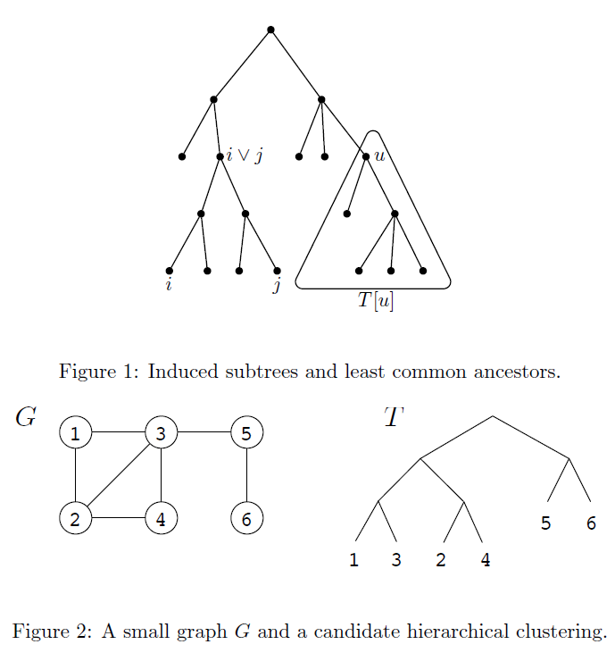

## Maximizing the mutual information between samples and cluster labels

Abbreviated as MIC. Do not use KL-divergence because of computational difficulty.

Suppose there are $N$ samples and $n$ clusters.
$$
MI(C,x) = \sum_{p=1}^n\sum_{X} (P(C_p,x) - P(C_p)P(x))^2
$$
Estimating $P(C_p)​$ from sample distribution directly. 

Use Mixture Gaussian model to describe $P(x), P((C_p,x))$. 
$$
\begin{align*}
P(x) &= \frac{1}{N} \sum_{i=1}^N G(x-x_i, \sigma^2) \\
P(C_p, x) &= \frac{1}{N} \sum_{k=1}^{N_p} G(x-x_{p,k}, \sigma^2)
\end{align*}
$$
Use agglomerative hierarchical clustering to increase $MI(C,x)$ in each step. [ICIP 2007]

That is, to compute $\Delta MI(C,x)$ when two clusters $C_a, C_b$ are merged to $C_p$.

Ours: Minimizing the multivariate mutual information between different clusters.

## Bayesian Hierarchical Clustering

Abbreviated as BHC [ICML 2005].

Use Bayesian posterior probability to determine which two clusters to merge in the framework of agglomerative clustering.

Suppose there are $D_1, \dots, D_r$ clusters, each cluster consists of several points $D_k = \{x_{k_1},\dots x_{k_r}\}$

For any two clusters $D_i, D_j$, we can compute the posterior probability to merge them. Let $H^{k}_1$ be the prior probability that $D_i, D_j$

should be merged: $D_k = D_i \cup D_j$. $H_2^{k}$ is the counterpart. Let $\pi_k = \Pr(H_1^{k})$. Then 

$$
r_k = \Pr(H_1^k | D_k) = \frac{\pi_k \Pr(D_k | H_1^k)}{\pi_k \Pr(D_k | H_1^k) + (1-\pi_k)\Pr(D_k | H_2^k)}
$$

There are three components to compute in this posterior: $\pi_k, \Pr(D_k | H_1^k)​$ and $\Pr(D_k | H_2^k)​$

$\Pr(D_k | H_2^k)$ is easy to be decomposed as $\Pr(D_k | H_2^k)=Pr(D_i | T_i) \Pr(D_j | T_j)$

Under the hypotheses $H_1^k​$, points $D_k​$ are coming from the same distribution, $p(x|\theta)​$. We choose $\theta = (\mu, \Sigma)​$ where both $\mu​$ and $\Sigma​$ are unknown. Using Bayesian inference, we choose Normal-inverse-Wishart distribution as prior for $\theta​$.  The prior has four parameters $\mu_0, \lambda, \Psi, \nu​$.

The posterior of $\theta$ has close form solution. 
$$
\begin{align}
\mu_n & = \frac{\lambda \mu_0 + n \bar{x}}{\lambda + n} \\
\lambda_n & = \lambda + n \\
\nu_n & = \nu + n \\
\Psi_n &= \Psi + \sum_{i=1}^n (x_i - \bar{x})(x_i - \bar{x})^T + \frac{\lambda n}{\lambda + n}(\bar{x} - \mu_0)(\bar{x} - \mu_0)^T
\end{align}
$$
Also, the distribution for data can be obtained. That is
$$
\Pr(D_k | H_1^k) = \frac{\Gamma_p(\nu_n/2)}{\Gamma_p(\nu/2)}\frac{|\Psi|^{\nu/2}}{|\Psi_n|^{\nu_n/2}}\left(\frac{\lambda}{\lambda_n}\right)^{\frac{p}{2}}(2\pi)^{-n/2}
$$
Notice $p​$ is the dimension of $x​$.

For the third quantity $\pi_k$, its formula comes from Dirichlet process:
$$
\begin{align}
\pi_k & = \frac{\alpha g(n_k)}{ d_k } \\
d_k &= \alpha g(n_k) + d(T_i) d(T_j)
\end{align}
$$
Notice that $\alpha$ is the concentration parameter. The larger $\alpha$ is, the larger the prior $\Pr(H_1^k)$ is. $g(n)$ is a function such that a probability that a new point joining an existing cluster is proportional to the number of data points already in that cluster.

Therefore, $g(n) = (n-1)g(n-1) \Rightarrow g(n) = (n-1)!​$.

## Cost function on clustering tree

Given pairwise similarity between data points, we would like to find a clustering tree which minimizes the following cost function [STOC 2016]
$$
\textrm{cost}_G(T) = \sum_{\{i,j\} \in E} w_{ij} |\textrm{leaves}(T[i\cup j])|
$$

Based on this cost function, the optimal clustering tree is binary. Exactly solving the optimization problem is NP-Hard. We can use an approximation method, which chooses a split $V \to (S, V \backslash S)​$ according to the sparsest cut criterion and recurse on each half. The sparsest cut is
$$
\min_{S} \frac{w(S, V\backslash S)}{|S| |V \backslash S|}
$$
